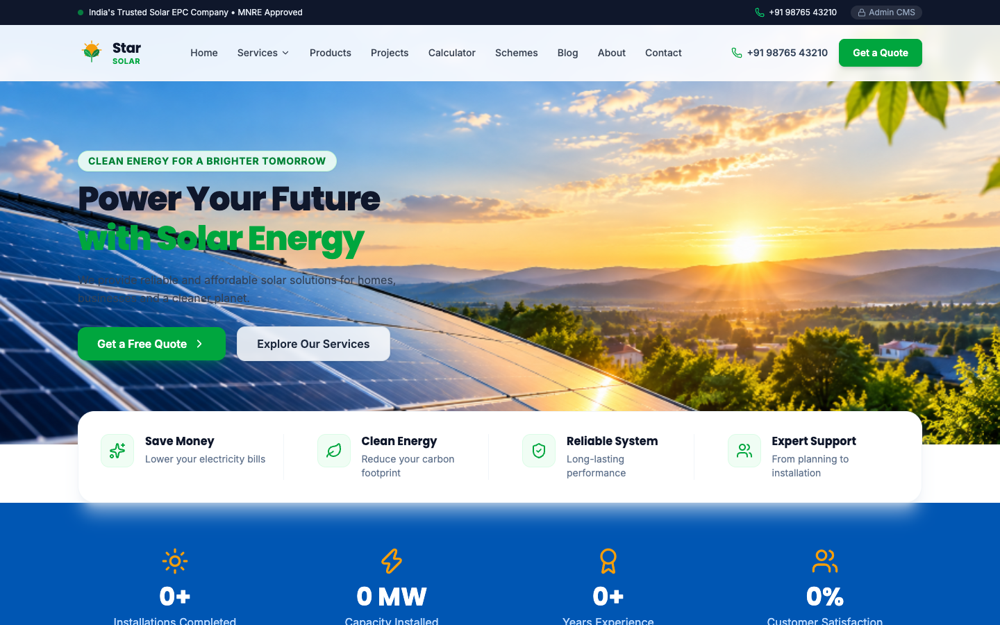
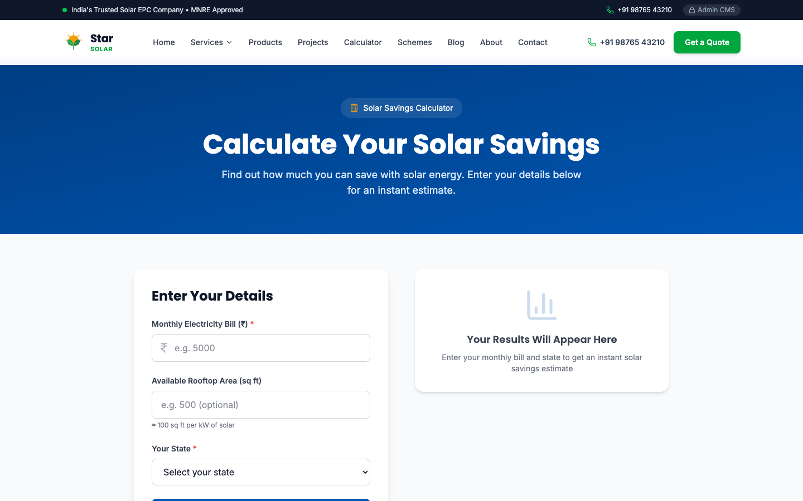
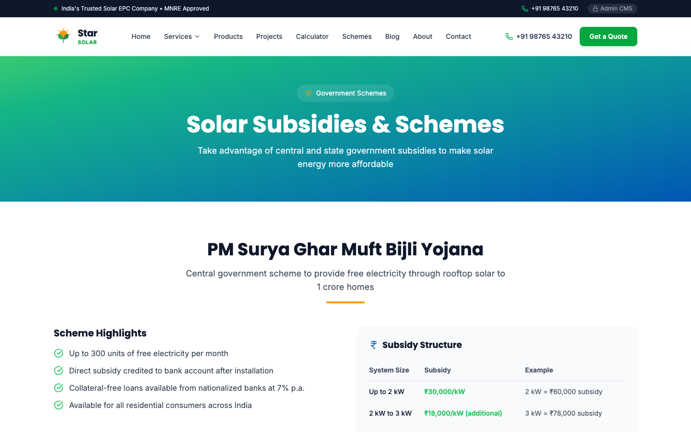
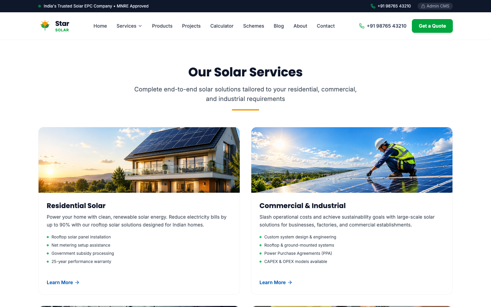
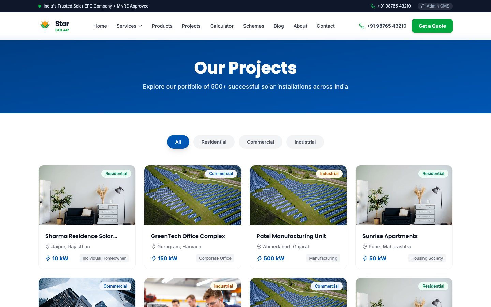
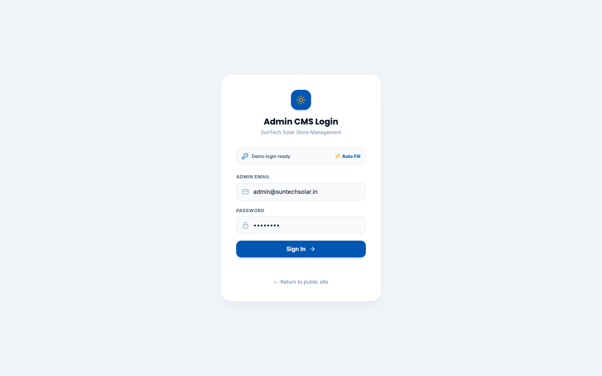
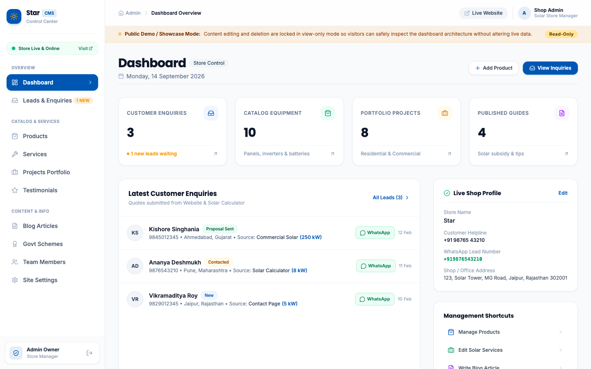
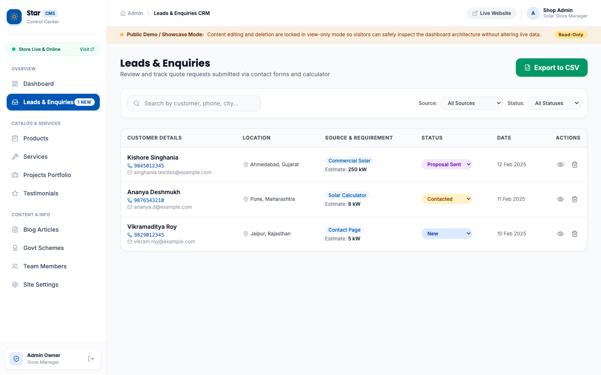

# ☀️ SunTech Solar — Next-Gen Solar EPC & Smart CMS Platform

<div align="center">


<p align="center">
  A full-stack, enterprise-grade web application built for modern Solar EPC (Engineering, Procurement, Construction) providers. Featuring a consumer-facing quotation engine, interactive solar ROI/subsidy calculator (PM Surya Ghar Yojana), and an integrated 10-module zero-setup CMS Admin Panel with CRM lead tracking.
</p>

[Explore Website](#-key-features) • [Admin Panel](#-admin-cms-features) • [Getting Started](#-getting-started) • [Screenshots](#-visual-walkthrough--screenshots) • [Architecture](#-tech-stack--architecture)

</div>

---

## 🌟 Visual Walkthrough & Screenshots

### 1. Modern Responsive Homepage & Panoramic Hero
> Featuring 3-slide panoramic photography, MNRE certification credentials, floating 4-value guarantee bar, and an infinite brand marquee showcasing trusted tier-1 manufacturers (Tata Power, Adani, Waaree, Havells, Schneider, ABB, Tesla, etc.).



---

### 2. Interactive Solar Subsidy & ROI Calculator
> Calculates system size (kW), estimated solar generation (units/month), monthly bill savings (₹), central government PM Surya Ghar subsidy (up to ₹78,000), and net investment with a 1-click quote inquiry submission form.



---

### 3. Government Schemes & Subsidy Guide
> Comprehensive breakdown of PM Surya Ghar: Muft Bijli Yojana, eligibility criteria, subsidy slabs, and state-specific incentives with direct application guidance.



---

### 4. Solar EPC Services Showcase
> Dedicated services for Residential Rooftops, Commercial & Industrial Solar Plants, Off-Grid/Hybrid Solar Systems, and Annual Maintenance Contracts (AMC).



---

### 5. Verified Projects Portfolio
> Interactive case studies highlighting installed solar capacities, client types, geographic locations, and generation metrics.



---

### 6. Admin CMS Security & Dashboard
> Enterprise security with session-cookie protected edge middleware. Real-time metrics tracking inquiries, active projects, catalog products, and articles.

<div align="center">
  
  
</div>

---

### 7. Centralized CRM Leads Management & WhatsApp Integration
> Lead pipeline tracking with real-time status filtering (New, Contacted, Proposal Sent, Converted), CSV data export, and 1-click personalized WhatsApp chat initiation.



---

## 🚀 Key Features

### 🏡 Public Platform
- **Panoramic Hero Slider**: 3-slide smooth auto-rotating panoramic slider with crisp photography and clear CTA links.
- **Solar Savings & Subsidy Calculator**: Real-time kW sizing, monthly electricity savings estimation, and PM Surya Ghar central subsidy computation.
- **Trusted Partners Marquee**: Continuous infinite-scroll carousel rendering official vector logos of Tier-1 solar brands (Tata Power Solar, Adani Solar, Waaree Energies, Havells, Luminous, Canadian Solar, Jinko Solar, Growatt, Fronius, Sungrow, Schneider Electric, ABB, Tesla Solar).
- **Government Schemes Knowledge Hub**: Detailed eligibility breakdown, subsidy tiers, and net-metering application steps.
- **Interactive Projects Showcase**: Categorized portfolio filtering across Residential, Commercial, and Industrial installations.
- **Knowledge Center & Blog**: SEO-optimized articles with rich markdown formatting and solar guides.
- **Floating WhatsApp & Quick Inquiries**: Instant customer support with pre-filled WhatsApp consultation messages.

### 🛡️ Admin CMS & CRM System
- **Zero-Setup Database Architecture**: Robust JSON database engine (`src/data/db.json`) requiring zero external database configuration or credit cards to run.
- **Protected Edge Middleware**: Every `/admin/*` route is safeguarded by HTTP session cookies and automatic redirect guards.
- **Safe Demo Mode**: Read-only mutation protection returning HTTP 200 simulations when showcasing the admin panel publicly.
- **10 Core Management Modules**:
  1. **Dashboard (`/admin`)**: Analytics, recent leads feed, quick action links.
  2. **Leads CRM (`/admin/leads`)**: Inquiries filter, search, detail modal, CSV export, and WhatsApp follow-up.
  3. **Site Settings (`/admin/settings`)**: Company profile, phones, addresses, social links, working hours.
  4. **Services Manager (`/admin/services`)**: Manage EPC service categories, icon selectors, and deliverables.
  5. **Products Catalog (`/admin/products`)**: Panels, inverters, and battery listings with specifications and pricing.
  6. **Projects Portfolio (`/admin/projects`)**: Solar project showcase with site photos and capacity specs.
  7. **Testimonials (`/admin/testimonials`)**: Customer reviews, star ratings, and avatars.
  8. **Blog & News Editor (`/admin/blog`)**: WYSIWYG rich text editor with category tags and publishing status.
  9. **Team Profiles (`/admin/team`)**: Leadership team, engineering roles, and bios.
  10. **Government Schemes (`/admin/schemes`)**: PM Surya Ghar subsidy slab editor and eligibility criteria.

---

## 🔑 Admin Credentials (Demo)

| Attribute | Value |
|-----------|-------|
| **Admin Login URL** | `/admin/login` |
| **Email** | `admin@suntechsolar.in` |
| **Password** | `admin123` |
| **Access Protection** | Session Cookie via Next.js Middleware |
| **Demo Mode** | Enabled by default (Safe simulations on mutations) |

---

## 🛠️ Tech Stack & Architecture

```
├── Framework:        Next.js 16.3.5 (App Router, Turbopack / Webpack)
├── UI Library:       React 19.2.8
├── Styling:          Tailwind CSS v4 (Modern CSS theme configuration)
├── Icons:            Lucide React
├── Notifications:    React Hot Toast
├── Typography:       Google Fonts (Inter & Poppins)
├── Data Layer:       Structured JSON Data Store (`src/data/db.json`)
└── Deployment:       Vercel (Edge Middleware + Serverless Route Handlers)
```

### Architecture Diagram

```mermaid
flowchart TD
    subgraph Client / Visitor
        V[Public Visitor] -->|Browse & Calculate| UI[Next.js App Router]
        UI -->|Request Free Quote| API_L[/api/leads]
    end

    subgraph Admin Portal
        A[Admin / Shop Owner] -->|Authenticate| Login[/api/auth/login]
        Login -->|Set HTTP-only Cookie| MW[Next.js Middleware Guard]
        MW --> AdminUI[10 Admin CMS Modules]
        AdminUI -->|Manage Content| API_C[/api/*]
    end

    subgraph Data & Storage
        API_L --> DB[(src/data/db.json)]
        API_C --> DB
        AdminUI -->|Upload Media| Media[public/uploads/]
    end
```

---

## 📁 Project Directory Structure

```
├── public/
│   ├── favicon.ico              # Multi-resolution brand favicon
│   ├── icon.svg                 # Scalable SunTech eco brand logo
│   ├── apple-icon.png           # iOS home screen web clip icon
│   ├── images/
│   │   ├── hero/                # Panoramic hero carousel slides (1024x396)
│   │   └── partners/            # Authentic vector partner logos (Tata, Adani, ABB...)
│   └── uploads/                 # Dynamically uploaded media from Admin CMS
├── src/
│   ├── app/
│   │   ├── layout.tsx           # Global layout with dynamic brand metadata
│   │   ├── page.tsx             # Main homepage
│   │   ├── calculator/          # Solar ROI & Subsidy calculation engine
│   │   ├── schemes/             # PM Surya Ghar Yojana information
│   │   ├── services/            # Solar EPC services listing & category pages
│   │   ├── projects/            # Real-world solar installation portfolio
│   │   ├── blog/                # Published articles & individual slugs
│   │   ├── contact/             # Contact page with lead capture
│   │   ├── admin/               # 10 CMS Admin management pages
│   │   └── api/                 # RESTful Route Handlers (auth, leads, settings...)
│   ├── components/
│   │   ├── Header.tsx           # Sticky navigation with MNRE bar & CTA
│   │   ├── Footer.tsx           # Multi-column footer with live company data
│   │   ├── Logo.tsx             # Eco Sun+Leaf custom SVG brand mark
│   │   ├── ui/
│   │   │   └── BrandStrip.tsx   # Continuous marquee partner carousel
│   │   └── admin/               # Admin sidebar, modals, and management components
│   ├── data/
│   │   └── db.json              # Local persistent JSON database
│   ├── lib/
│   │   ├── auth.ts              # Session token generation & verification
│   │   └── db.ts                # Database query & mutation methods
│   └── middleware.ts            # Route authentication & demo-mode safety guard
└── docs/
    └── screenshots/             # High-resolution screenshots for documentation
```

---

## 💻 Getting Started

### Prerequisites
- **Node.js**: `v18.17.0` or later
- **npm** or **pnpm**

### 1. Clone the repository
```bash
git clone https://github.com/tusharnangare31/SolarDemoWebsie.git
cd SolarDemoWebsie
```

### 2. Install dependencies
```bash
npm install
```

### 3. Run the development server
```bash
npm run dev
```

Open [http://localhost:3000](http://localhost:3000) in your browser.

### 4. Build for production
```bash
npm run build
npm run start
```

---

## ⚙️ Environment Variables

Create a `.env.local` file in the root directory if you wish to override default credentials or toggle live write permissions:

```env
# Admin Credentials
ADMIN_EMAIL=admin@suntechsolar.in
ADMIN_PASSWORD=admin123

# Demo Mode Toggle
# Set to 'false' to enable real write mutations on production
NEXT_PUBLIC_DEMO_MODE=true
```

---

## ☁️ Deployment on Vercel

1. Push your repository to GitHub.
2. Connect your GitHub repository to [Vercel](https://vercel.com).
3. Vercel automatically detects Next.js:
   - **Framework Preset**: Next.js
   - **Build Command**: `npm run build`
   - **Output Directory**: `.next`
4. Click **Deploy**. Your production URL will be live in seconds!

---

## 📄 License

This project is licensed under the **MIT License**.

---

<div align="center">
  <b>SunTech Solar EPC Platform</b> • Crafted for clean energy transformation across India 🇮🇳
</div>
